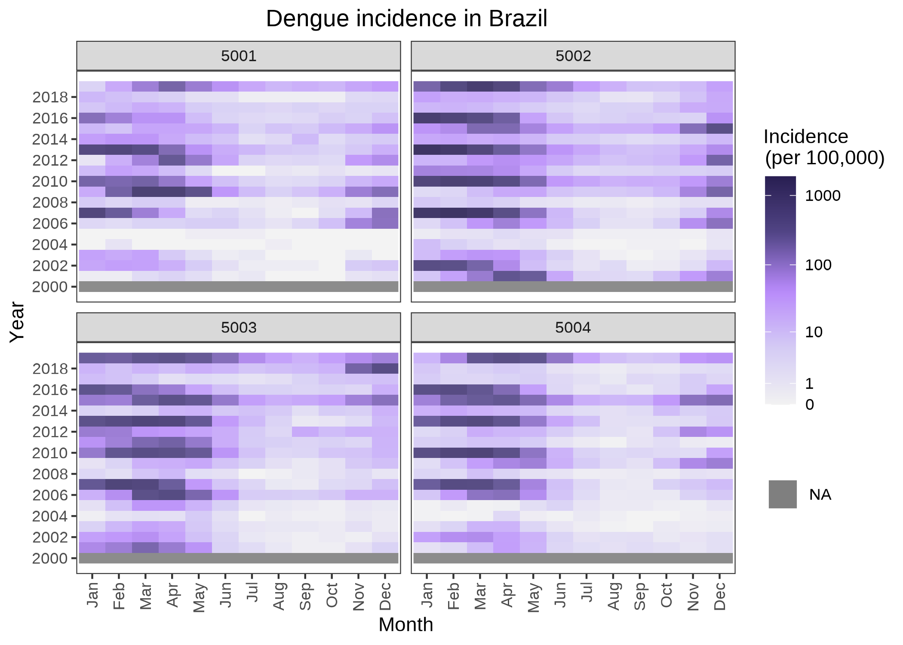

# GHRexplore   <span> <span>  

<!-- badges: start -->
[](http://www.gnu.org/licenses/gpl-2.0.html)
[](https://cran.r-project.org/package=GHRexplore)
[](https://cran.r-project.org/package=GHRexplore)
[](https://cran.r-project.org/package=GHRexplore)
<!-- badges: end -->


## Overview

**GHRexplore** is an R package for exploratory analysis of temporal and spatio-temporal 
health data including case counts, incidence rates, and covariates. It provides commonly 
used visualizations and supports standard data transformations such as temporal 
and spatial aggregations. The package also offers extensive customization options 
for the resulting figures. Currently available plotting functions include:

* `plot_timeseries`: Plots time series of covariates, case counts or incidence rates. 
* `plot_timeseries2`: Plots time series of two covariates, case counts or incidence 
rates using a dual-axis plot. 
* `plot_heatmap`: Plots a time series of covariates, case counts or incidence rates
as heatmaps. 
* `plot_seasonality`: Plots yearly time series to detect seasonal patterns of 
covariates, case counts or incidence rates. 
* `plot_correlation`: Plots a correlation matrix of a series of variables.
* `plot_map`: Plots a choropleth map of covariates, case counts or incidence rates. 
* `plot_bivariate`: Plots a bivariate plot of two numerical and/or categorical variables.
* `plot_multiple`, `plot_combine` and `plot_compare`: Used to generate graphs of 
several variables at the same time.

<br>

**GHRexplore** is one of the packages developed by the
[Global Health Resilience](https://www.bsc.es/discover-bsc/organisation/research-departments/global-health-resilience) (GHR)
team at the [Barcelona Supercomputing Center](https://www.bsc.es/) (BSC) within the
[IDExtremes](https://www.bsc.es/es/research-and-development/projects/idextremes-digital-technology-development-award-climate-sensitive) project. 
**GHRexplore** is the starting point for building INLA models for inference and 
forecasting of health impacts. It is complemented by the **GHRmodel** package, 
which is used to define, fit, and assess the models, and by **GHRpredict**, which 
focuses on generating out-of-sample predictions, conducting cross-validation analyses, 
and evaluating predictive performance. Both **GHRmodel** and **GHRpredict** are 
scheduled for release on CRAN in summer 2025.

## Installation

```R
# Install from CRAN
install.packages("GHRexplore")

# Get the development version from Gitlab
devtools::install_git('https://earth.bsc.es/gitlab/ghr/ghrexplore.git')
```

## Usage

```R
library("GHRexplore")

# Use data included in the package to plot a heatmap with spatial aggregation
data("dengue_MS")
plot_heatmap(data = dengue_MS,
             var = "dengue_cases",
             type = "inc",
             pop = "population",
             time = "date",          
             area = "micro_code",   
             aggregate_space = "meso_code",
             transform = "log10p1",
             title = "Dengue incidence in Brazil") 
```

<span> 

## Developers

**[Giovenale Moirano, PhD](https://www.bsc.es/moirano-giovenale)**
<a href="https://orcid.org/0000-0001-8748-3321" style="margin-left: 15px;"></a>\
Barcelona Supercomputing Center\
Global Health Resilience

**[Carles Milà, PhD](https://www.bsc.es/mila-garcia-carles)**
<a href="https://orcid.org/0000-0003-0470-0760" style="margin-left: 15px;"></a>\
Barcelona Supercomputing Center\
Global Health Resilience

**[Anna B. Kawiecki, PhD](https://www.bsc.es/kawiecki-peralta-ania)**
<a href="https://orcid.org/0000-0002-0499-2612" style="margin-left: 15px;"></a>\
Barcelona Supercomputing Center\
Global Health Resilience

**[Rachel Lowe, PhD](https://www.bsc.es/lowe-rachel)**
<a href="https://orcid.org/0000-0003-3939-7343" style="margin-left: 15px;"></a>\
Barcelona Supercomputing Center\
Global Health Resilience (Group leader)


